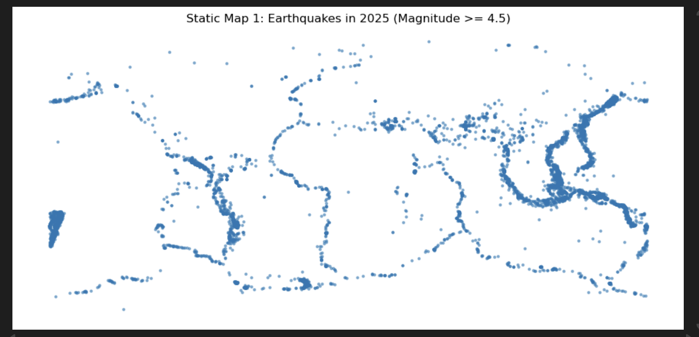
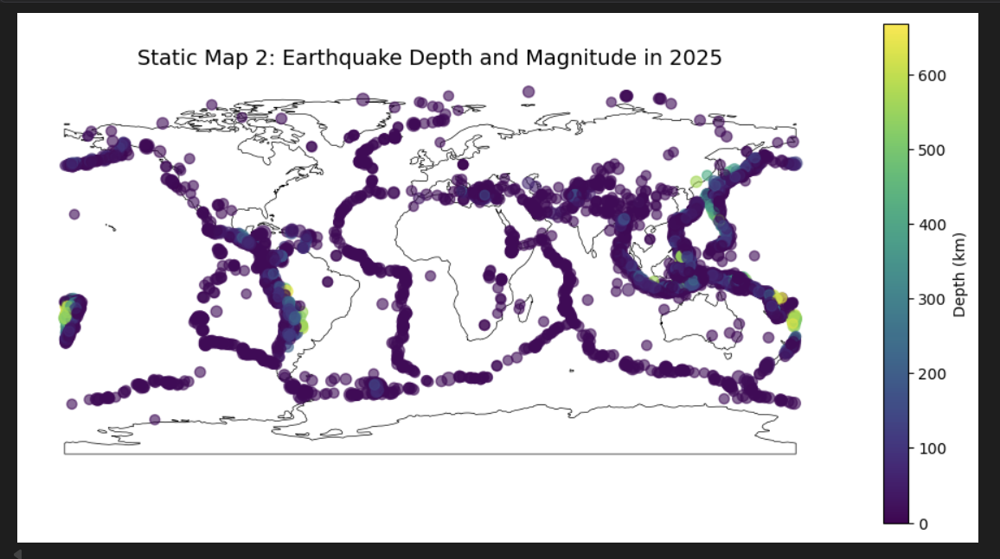
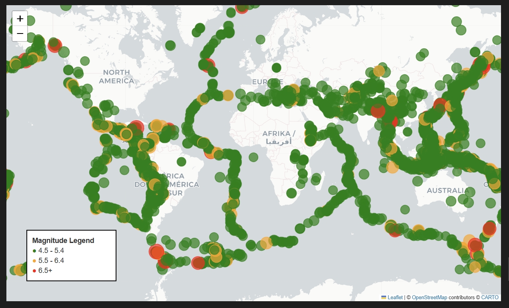

# Global Earthquakes Visualisation

## Overview

This project analyses and visualises global earthquake activity using data from the USGS Earthquake Catalog API. The aim is to explore how earthquake magnitude, location, and depth can be represented through static and interactive geospatial visualisations.

The project uses Python to retrieve and prepare earthquake data, then creates maps to communicate spatial patterns in a clear and accessible way.

## Tools Used

- Python
- pandas
- GeoPandas
- Matplotlib
- Folium
- requests
- USGS Earthquake Catalog API

## Dataset

The data comes from the USGS Earthquake Catalog API. The project focuses on global earthquake events from 2025 with magnitude 4.5 and above.

Key variables used include:

- Magnitude
- Latitude
- Longitude
- Depth
- Place
- Time

## What I Did

- Retrieved earthquake data from the USGS API
- Converted GeoJSON data into a pandas DataFrame
- Prepared spatial data using GeoPandas
- Created static earthquake maps using Matplotlib
- Created an interactive map using Folium
- Used marker size and colour to represent earthquake magnitude
- Added popups to show additional earthquake details

## Project Outputs

### Static Map: Earthquake Magnitude

This map shows the global distribution of earthquakes with marker size and colour used to represent magnitude.

### Static Map: Earthquake Depth

This map explores earthquake depth as an additional variable, helping to show where deeper and shallower events occur.

### Interactive Map Preview

The interactive map allows users to explore individual earthquake events using popups with magnitude, location, depth, and time information.

## Key Skills Demonstrated

- API data retrieval
- JSON and GeoJSON handling
- Data cleaning and preparation
- Geospatial data analysis
- Static and interactive data visualisation
- Communicating insights through maps

## Current Status

This repository currently includes the main project notebook. Outputs, screenshots, and additional explanation will be added as the project is developed further.

## Future Improvements

- Add more detailed map styling
- Add screenshots of the static and interactive maps
- Add a cleaner project notebook
- Add explanation of the main findings
- Add setup instructions and package version details for reproducibility
